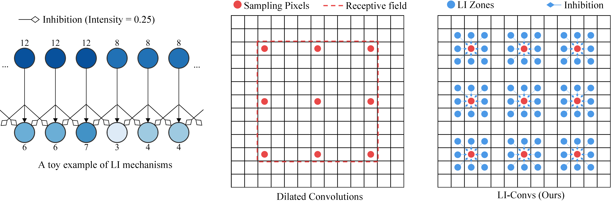

# Dilated Convolutions with Lateral Inhibitions for Semantic Image Segmentation

This repository contains the Tensorflow implementation of the [following paper](https://arxiv.org/abs/2006.03708):
```bibtex
@article{wang2020dilated,
  title={Dilated convolutions with lateral inhibitions for semantic image segmentation},
  author={Wang, Yujiang and Dong, Mingzhi and Shen, Jie and Lin, Yiming and Pantic, Maja},
  journal={arXiv preprint arXiv:2006.03708},
  year={2020}
}
```

In this work, we have added Lateral Inhibition (LI) mechanism to dilated convolutions and propose the Dilated Convolutions with Lateral Inhibitions (LI-Convs):



Please consider to cite this work if you find our code useful.

Let `$ROOT` be the project root directory where this README resides.

## Tables of Contents

* [Dependencies](#dependencies)
* [Datasets](#datasets)
* [Configs](#configs)
* [Evaluate checkpoints](#evaluate-checkpoints)
* [Training](#training)
* [LI Layer Usage](#li-layer-usage)

## Dependencies 

We recommand to use [Anaconda](https://www.anaconda.com/) to install and manage dependencies.

* Python 3.7.6 
```
conda create --name li_conv python=3.7.6
conda activate li_conv
pip install --upgrade pip
```
* Cuda 10.0, cudnn 7.6.0
```
conda install -c anaconda cudatoolkit=10.0
conda install -c anaconda cudnn=7.6.0
```

* Tensorflow-gpu 1.15, opencv, matplotlib, pypng, pillow, scipy, h5py, seaborn, numpy
```
cd $ROOT
pip install -r requirements.txt
```

## Datasets

NOTE: Datasets will be downloaded to `$ROOT/../dataset`. Please make sure this path is reserved to avoid any data corruption.

First navigate to working directory: ```cd $ROOT/dataset_generation```

* ADE20K (source: [Deeplab](https://github.com/tensorflow/models/tree/master/research/deeplab)): ```bash download_and_build_ade20k.sh```

* For PascalVoc2012, first download [augmented annotations](https://www.dropbox.com/s/oeu149j8qtbs1x0/SegmentationClassAug.zip?dl=0) 
(source: [this github](https://github.com/DrSleep/tensorflow-deeplab-resnet) and [Deeplab](https://github.com/tensorflow/models/tree/master/research/deeplab)), and place the downloaded "SegmentationClassAug.zip" under `$ROOT/../dataset/pascal_voc_seg` as following:
    ```
    + $ROOT
        + dataset_generation
            - build_voc2012_with_aug.sh
            ...
    + dataset
        + pascal_voc_seg
            + SegmentationClassAug.zip
    ```
  Then run the scrip: ```bash build_voc2012_aug.sh```
  
* For CelebAMask-HQ, please first download the [dataset](https://drive.google.com/open?id=1badu11NqxGf6qM3PTTooQDJvQbejgbTv) (source: [CeleAMask-HQ](https://github.com/switchablenorms/CelebAMask-HQ)), and unzip the downloaded "CelebAMask-HQ.zip" to `$ROOT/../dataset/` as following:
    ```
    + $ROOT
        + dataset_generation
            - preprocess_CelebAMaskHQ.sh
            - build_CelebAMaskHQ.sh
    + dataset
        + CelebAMask-HQ
            + CelebA-HQ-img
            + CelebAMask-HQ-mask-anno
            - CelebA-HQ-to-CelebA-mapping.txt
            ...
    ```
    Then run the pre-processing script: ```bash preprocess_CelebAMaskHQ.sh```
    
    And the building script: ```bash build_CelebAMaskHQ.sh```
    
## Configs
All modifiable parameters are put into config files locating under `$ROOT/config/$DS` where `$DS` is the dataset name. See `$ROOT/config/config_example/config_sample.ini` for a config sample with detailed comments. 
    
## Evaluate checkpoints

NOTE: Evaluation results will be saved to `$ROOT/../LI-Convs-snapshots/$DS/$CF/test` where `$CF` is the name of the config file. Please reserve this path to avoid data corruption.


Download the [pre-trained checkpoints](https://drive.google.com/file/d/1qZP4XpAlTQegM1SQ7uDeN-L0byIIXiyF/view?usp=share_link) and unzip the downloaded "LI-Convs-snapshots.zip" to `$ROOT/../LI-Convs-snapshots` as following: 
```
+ $ROOT
    + dataset_generation
    - README.md
    ...
+ dataset
+ LI-Convs-snapshots
    + init_models
    + LI_models
```

Navigate to working directory: ```cd $ROOT/runners```
* Evaluate on ADE20K: ```bash evaluate_ade20k.sh```
* Evaluate on PascalVoc2012: ```bash evaluate_pascalVoc2012.sh```
* Evaluate on CelebaMask-HQ: ```bash evaluate_celebaMask.sh```

To compute the model parameters and FLOPs, add `--calculate_model_flops_and_params True` to the evaluation script ("test.py") in the bash file.

## Training

NOTE: Training data will be saved to `$ROOT/../LI-Convs-snapshots/$DS/$CF/train`. Please reserve this path to avoid data corruption.

NOTE: Before training, make sure checkpoints are already downloaded and properly placed as in [Evaluate checkpoints](#evaluate-checkpoints).

First navigate to working directory: ```cd $ROOT/runners```
* Run an example training session on ADE20K: ```bash train_ade20k.sh```
* Run an example training session on PascalVoc2012: ```bash train_pascalVoc2012.sh```
* Run an example training session on CelebaMask-HQ: ```bash train_celebaMask.sh```

Some hints:
* The options in the config file can be overwritten by passing corresponding arguments to the script. For example, to change the batch size to 12, simply add `--train_batch_size 12` to the execution of "train.py".
* The positions of LI layers in backbone is controlled by option "li_backbone_option_mnv2" (MNV2) or "li_resnet_option" (ResNet). See `$ROOT/li_models/li_backbones.py` for detailed option meanings.
* The performance of LI models can be refined by a fine-tuning on LI weights. Just passing `--finetune_li_weight_only True` to the training script and specific the checkpoint path "tf_initial_checkpoint" that would like to be fine-tuned.

## LI Layer Usage
The implementation of LI-Convs can be found at `$ROOT/li_utils/conv_ops.py`. 

Here we provide a toy example. First navigate to working directory: `cd $ROOT/runners`. 
```
import tensorflow.compat.v1 as tf
import sys
# add necessary paths
sys.path.insert(0,'../')
sys.path.insert(0, '../libs/deeplab_v3plus')
sys.path.insert(0, '../libs/deeplab_v3plus/slim')

# the feature before LI layer
feature_before_li=tf.random.uniform(shape=(1,32,32,4), minval=0.0, maxval=1.0)

from li_utils.conv_ops import lateral_inhibition_layer as LI_layer

# create a LI layer
feature_after_li=LI_layer(
    feature_before_li,
    scope='lateral_inhibition',
    li_zone=3,
    li_rate=1,
    li_activation_fn=tf.nn.relu,
    li_weight_initilizer_params={"maxval":0.0, "minval":0.0},
    )
```
 

